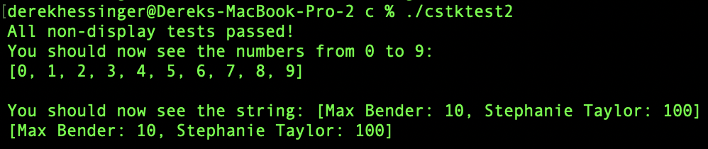

# Project 3
Derek Hessinger  
Professor Ying Li  
CS 333  
10/17/24

## Google sites url: https://sites.google.com/colby.edu/dereks-cs333-site/home?authuser=1

## Directory Tree
```
.
├── README.md
├── c
│   ├── cstk.c
│   ├── cstk.h
│   ├── cstk2.c
│   ├── cstk2.h
│   ├── cstktest
│   ├── cstktest.c
│   ├── cstktest2
│   └── cstktest2.c
├── c++
│   ├── task1.cpp
│   ├── task2.cpp
│   ├── task3.cpp
│   ├── task4.cpp
│   └── task5.cpp
├── media
│   ├── task1.png
│   └── task2.png
└── ocaml
    ├── task1.ml
    ├── task2.ml
    ├── task3.ml
    ├── task4.ml
    └── task5.ml
```

## Operating system and C compiler
OS: Apple Sonoma \
C compiler: Apple clang version 15.0.0 (clang-1500.3.9.4), Target: arm64-apple-darwin23.5.0, Thread model: posix

## Part 1
### Task 1-3
To compile and run the program:
```
gcc -o cstktest cstktest.c cstk.c
./cstktest
```
There are no known bugs within the program. 

Output of the program:


###  Task 4

Video of memory usage test can be found with this link:
https://drive.google.com/file/d/1bWtChTChcXvUMa9KnQhSEuMfcPnAEvFc/view?usp=sharing

### Task 5  
At Mark 1, a stack was initialized with a capacity of 20 elements, and integers from 1 to 10 were pushed onto it. Each element was stored in a heap-allocated array, with the top pointer updated to the next available position. The printed memory addresses (from the print statements in toDraw.c) show the locations of the stack, its heap array, and the loop variable.

At Mark 2, after calling stk_destroy, the memory allocated for the stack's data was freed. Although the pointer still holds the original memory address, that memory is now invalid. Any attempt to access the stack at this point would result in undefined or invalid behavior, as the memory has been deallocated.


### Task 6
To compile and run the program:
```
gcc -o cstktest2 cstktest2.c cstk2.c
./cstktest2
```
There are no known bugs within the program

The program uses dynamic memory allocation wihtin the toString method. This is done by beginning with an initial buffer size for the string, then converting each of the elements within the stack to a string. After each element is converted, the required length for the string is recalculated. If the buffer size is less than the required size, the buffer size is made to be double the required size. That way, the amount of space allocated is never double the required size.

Output of the program:



Task 6: At Mark 1, the stack contained five integers from 0 to 4 and an account struct with the name "Max Bender" and a balance of 10. The stack pointers referenced memory addresses in the heap where these integers and the struct were stored. As more elements were pushed, the stack grew, and the top pointer moved to the next available slot.

At Mark 2, after freeing the stack's memory, the stack pointer still holds its original address, but the memory it references has been deallocated. This invalidates the stack, making further use of it or its contents impossible.

Memory drawing of the program:


## Extensions
For our extension, we completed task 2 in OCaml, which can be found on the google sites page.
